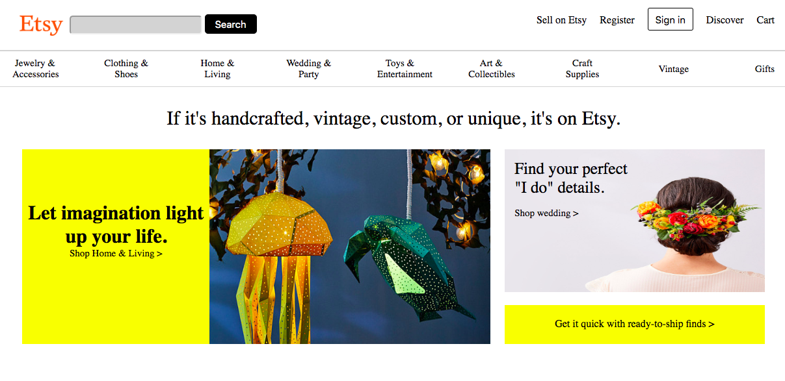

# _react-friday_

#### _Clone of Etsy_

#### By _**Nayomi Morita**_

## Description

_A webpage that mimics the functionality of Etsy with React components._

## Specs
* _CSS styling that mimics the homepage of Etsy_
* _Media Queries that allow for different screen sizes_
* _As a user I want to see the current "popular now" results, and be able to click them using the list component_

## Components
* _List component: will list "popular now" descriptors from hardcoded data_

## Completed Features
* _Component structure_
* _Multi-page routing_
* _Fully styled header with media queries_
* _Fully styled quote with media queries_
* _Fully styled shop grid with media queries_
* _Fully styled descriptions with media queries_
* _Fully styled populars with media queries_
* _Links to other pages in populars_

## MVP
* _Fully styled main page, with routing to secondary pages that display a specific popular object (not fully styled). List of populars (on main page) is displaying inputted data._

## Goals for first friday
* _Make component structure | completed, will adjust as project continues_
* _Setup react in my project and get component structure built | completed_
* _Route all pages succesfully | Completed_
* _Get majority of styling done | Completed_
* _Hard code data for populars and display them | Incomplete_

## Goals for second friday
* _Make Popular component | Completed_
* _Test component | Completed_
* _Use components state outside | in progress_

## Notes
* _I ran into an issue with inputs in the html, it was just a small difference in the syntax react wanted_
* _While recreating the same css from my angular project I noticed parts would need to be adjusted for them to look the same, although it seemed random, parts of it were spacing issues or it would just completely ignore my code_

## Component Structure:

## React Clone:

## Angular Clone:

## Original Site:

## Setup
* _Clone this repository_
https://github.com/nayomi-morita/react-friday.git
* _Use chosen code editor to make changes (I used atom)._
* _Install node/homebrew on device_
* _Run "npm i" in terminal in react-friday project_
* _Run "npm run start" in terminal to start/open webpage_

## Tech used
* _HTML_
* _CSS_
* _React_
* _Webpack_
* _JavaScript_

### license

Copyright (c) 2019 **Nayomi Morita**

This software is licensed under the GPL license.
