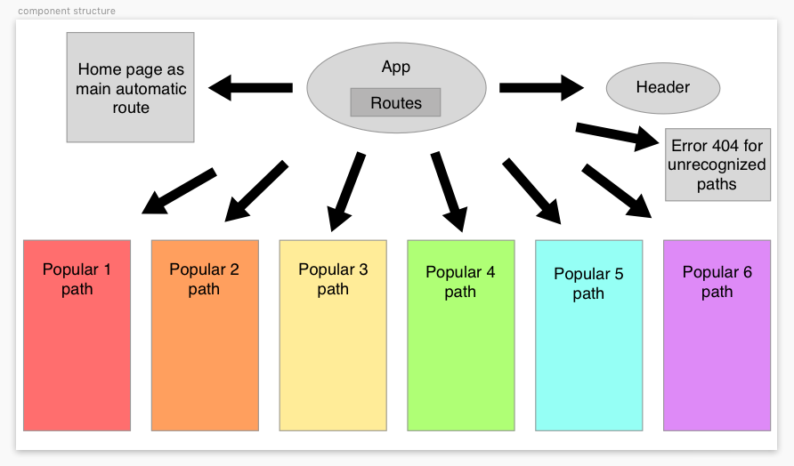
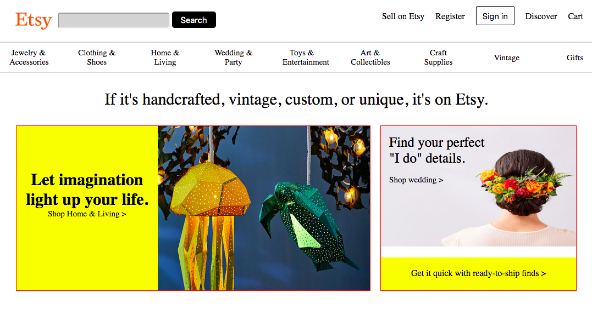
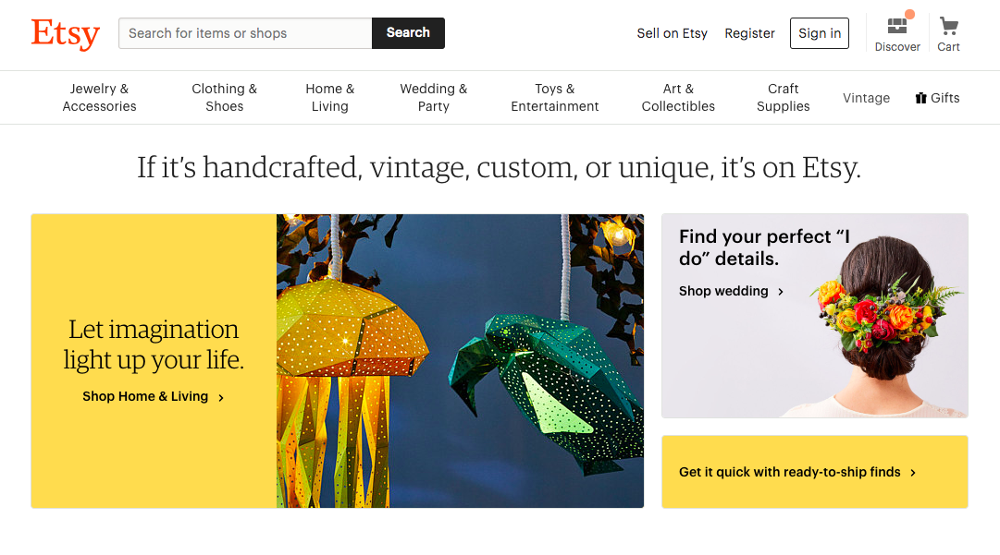

# _react-friday_

#### _Clone of Etsy_

#### By _**Nayomi Morita**_

## Description

_A webpage that mimics the functionality of Etsy with React components._

## Specs
* _CSS styling that mimics the homepage of Etsy_
* _Media Queries that allow for different screen sizes_
* _As a user I want to see the current "popular now" results, and be able to click them using the list component_

## Components
* _List component: will list "popular now" descriptors from firebase_

## Completed Features
<!-- * _Page header with working media queries for multiple sizes_ -->
<!-- * _Page quote with working media queries for multiple sizes_ -->
<!-- * _Main shop grid with working media queries for multiple sizes_ -->
<!-- * _Populars grid with working media queries for multiple sizes_ -->

## MVP
* _Fully styled main page, with routing to secondary pages that display a specific popular object (not fully styled). List of populars (on main page) is displaying hard coded data pulled from outside HTML._

## Goals for first friday
* _Make component structure | completed, will adjust as project continues_
* _Setup react in my project and get component structure built | starting to develope_
* _Get majority of styling done_
* _Hard code data for populars and display them_

## Component Structure:

## React Clone:

## Angular Clone:

## Original Site:

## Setup
* _Clone this repository_
https://github.com/nayomi-morita/react-friday.git
* _Use chosen code editor to make changes (I used atom)._
* _Install node/homebrew on device_
* _Run "npm i" in terminal in react-friday project_
* _Run "npm run start" in terminal to start/open webpage_

## Tech used
* _HTML_
* _CSS_
* _React_
* _Webpack_
* _JavaScript_

### license

Copyright (c) 2019 **Nayomi Morita**

This software is licensed under the GPL license.